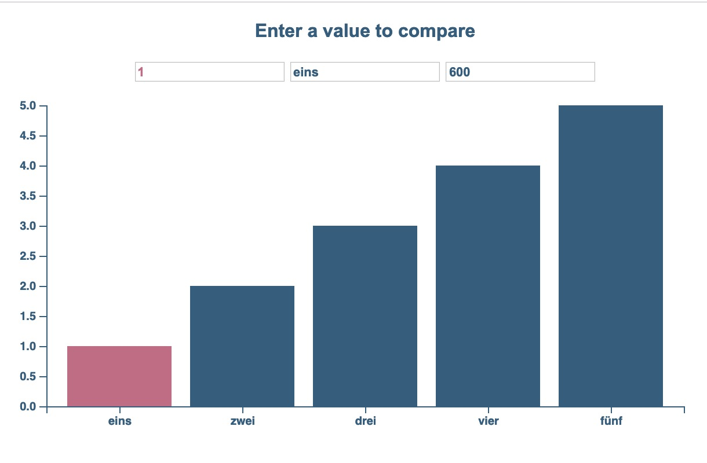
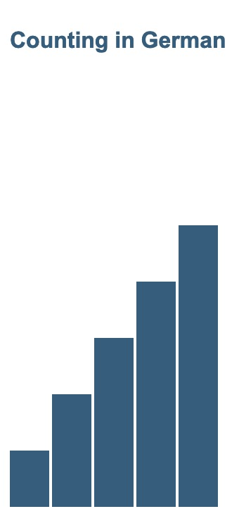
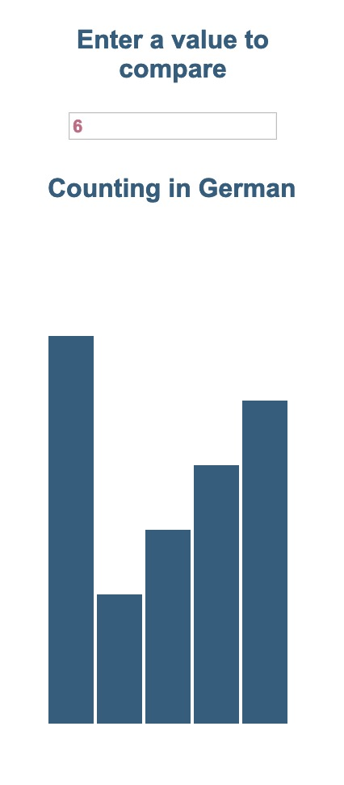

# Create a simple bar chart with Vue & D3

_Result_

## Prerequisites

Vue: [Vue is a progressive framework for building user interfaces](https://vuejs.org/v2/guide/)
D3: [D3.js is a JavaScript library for manipulating documents based on data](https://d3js.org/)

## Setup
Let’s start with a simple html and link our libraries:

``` html
<!DOCTYPE html>
<html>
<head>
  <meta charset="utf-8">
  <title>Simple Vue Bar Chart</title>
  <link rel="stylesheet" href="style.css"> <!-- provided some basic styles, which elements are transitioned might be interesting to look at -->
  <script src="https://d3js.org/d3.v5.min.js"></script> <!-- D3 here -->
  <script src="https://cdn.jsdelivr.net/npm/vue/dist/vue.js"></script> <!-- and Vue here -->
</head>
<body>
  <!-- This is our container div, that we will reference in our script-->
  <div id="bars"></div> 
  <!-- It’s important that your script is at the bottom of your body, 
  because we need the DOM to be ready-->
  <script src="script.js"></script>
</body>
</html>
```

## Create a Vue instance and use a data-driven chart title

First we need a title for our chart:

In script.js

``` js
var app = new Vue({
  el: '#bars',
  data: { 
    chartTitle: "Counting in German"
  }
})
```

And in index.html:

``` html
…
 <div id="bars">
   <h4>{{ chartTitle }}</h4>
 </div> 
 …
```

## A new svg approach

Instead of using D3 to build our SVG DOM elements we will use **Vue for the structure** and **D3 only for the practical scale and axis methods**. 

With Vue we can describe a regular DOM model in the html file and use vue commands to interact with the DOM model.

For a bar chart we should start with svg-tags and let’s make the width and height also data-driven: 

_script.js:_
``` js
data: { 
  chartTitle: "Counting in German",
  svgWidth: 600,
  svgHeight: 300
}
```

_index.html:_
```html
<!-- There are two ways to link data to attribute in a html tag
     v-bind: is the literal way
     “:” is a short-hand because this method is used quite often -->
<svg 
  v-bind:width="svgWidth" 
  :height="svgHeight">
</svg>
```

Check the DOM – the svg is already there width the correct

## A very simple data set

Let’s learn how to count in German along the way, this is the data set for our bar chart:

```js
data: [
    {name: "eins", val: 1},
    {name: "zwei", val: 2},
    {name: "drei", val: 3},
    {name: "vier", val: 4},
    {name: "fünf", val: 5}
]
```

We can make a bar chart with this data already using a rect-element and Vue’s command v-for to iterate over our data array:

``` html
<svg
…
>
<!-- with v-for we can iterate over our vue data
     similar to D3 we can define (d, i) or (element, index)
     of our array to use in the attributes
     remember : indicates that the string is interpreted
     you can use variables and calculations -->
  <rect v-for="(element, index) in data" 
    :height="element.val*40" 
    :width="28" 
    :x="index*30" 
    :y="svgHeight-element.val*40" 
    fill="#355C7D"
  />
</svg>
```

  

_And we should see our first bars_

**This is pretty sweet and concise code for a simple bar chart!**  

## Next steps

Of course everything gets a bit more complicated if we want to integrate D3 and use its methods to scale and generate axes for us. 

#### Can be done at any step:
- **V-model** and CSS transition: keeps states and facilitates animation between them:
 
``` html
 <div id="controls">
  <p>Enter a value to compare</p>
  <!-- v-model let’s us interact with our data
       we can maipulate the val property of the first element in the array
       with data[0].val -->
  <input class="red" v-model="data[0].val" type="number" placeholder="edit me">
</div>
```



#### Should be done step by step:
1. The Vue **computed** object/property offers a pretty concise way of **writing d3 scales**
```js
// https://stackoverflow.com/questions/48726636/draw-d3-axis-without-direct-dom-manipulation

computed: {
    width() {
      return this.svgWidth - this.margin.right - this.margin.left
    },
    height() {
      return this.svgHeight - this.margin.top - this.margin.bottom
    },
    scale() {
      const x = d3
        .scaleBand()
        .domain(this.data.map(x => x.name))
        .rangeRound([0, this.width])
        .padding(0.15);
      const y = d3
        .scaleLinear()
        .domain([0, Math.max(...this.data.map(x => x.val))])
        .rangeRound([this.height, 0]);
      return { x, y };
    }
  },
```
_needs a re-write of the rect-attributes of course_

2. Make **space for the axis**: Use **_computed_** for the margin convention and add a **\<g>** for the transform (new concept: **v-bind: with a string**)
3. The proper way to make D3 axes: Vue **directives**
4. **methods** to use functions in Vue, change color of the first bar
5. **v-model**, can be introduced here (already affecting scale & axis)
6. **v-model**, can alter any data of the Vue instance: **resize of the svg element for example!**

_Conclusion_
## Q&A


