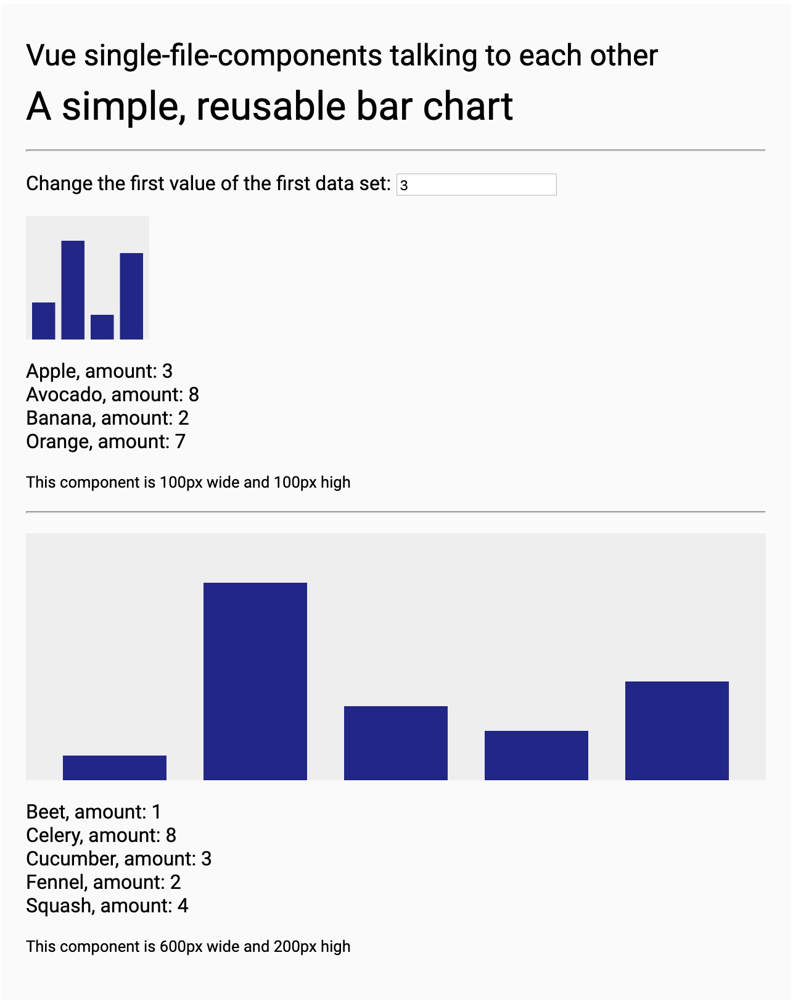

# Vue & webpack – Reusable charts!


The goal of the this workshop is to create reusable so called “single file components” to make reusable D3 charts, combine different graphs without worrying about namespace and have a more organized file structure for complex projects.
The caveat: learn a few new concepts and a one or two more steps in the workflow.

## What are single file components?

Vue supports its own file type: **.vue-files** which you can think of as small templates for parts of your website. They can be nested so you can abstract single features for your site like the navigation or a gallery in one file. We will use it to make a graph. Because we introduce a new file format that the browser can’t read natively we will have to translate them to proper HTML, JavaScript and CSS files. The software that can do this for us is **webpack** and we will install and interact with it using **NPM**

## Initial setup

```bash
npm init
```

### Folder structure:

```bash
.
├── package.json
├── src
│   ├── App.vue
│   ├── index.html
│   └── main.js
└── webpack.config.js
```

### Install dependencies

```bash
npm install vue vue-loader vue-template-compiler webpack webpack-cli webpack-dev-server babel-loader @babel/core @babel/preset-env css-loader vue-style-loader html-webpack-plugin rimraf -D
```

### Basic file templates

We need the three files in the src folder talk to each other. We provide a div in the html folder that has the id “app”. (Note: no reference to the main.js file here, we will use webpack.config.js to make that connection). In the main js file we import Vue from the node modules and our vue file form this folder. We then call a new instance of Vue and tell it to render the element “#app” in our index.html file

#### index.html

```html
<html>
  <head>
    <title>Vue, D3 & webpack – Reusable charts!</title>
  </head>
  <body>
    <div id="app"></div>
  </body>
</html>
```

#### main.js

```javascript
import Vue from "vue";
import App from "./App.vue";

new Vue({
  el: "#app",
  render: h => h(App)
});
```

#### App.vue

```vue
<template>
  <div id="app">{{ message }}</div>
</template>

<script>
export default {
  data() {
    return {
      message: "Let’s get started with Vue & webpack"
    };
  }
};
</script>

<style>
#app {
  font-size: 18px;
  font-family: "Roboto", sans-serif;
  font-weight: 900;
}
</style>
```

## Starting with webpack

### webpack.config.js

We need this template to tell webpack what to include. We need to load some of our webpack and vue dependencies and also declare our **entry file** as well as **where vue should be loaded**. Our entry point is "./src/main.js" and we use the VueLoaderPlugin to load "./src/index.html".

```javascript
const HtmlWebpackPlugin = require("html-webpack-plugin");
const VueLoaderPlugin = require("vue-loader/lib/plugin");

module.exports = {
  entry: "./src/main.js",
  module: {
    rules: [
      { test: /\.js$/, use: "babel-loader" },
      { test: /\.vue$/, use: "vue-loader" },
      { test: /\.css$/, use: ["vue-style-loader", "css-loader"] }
    ]
  },
  plugins: [
    new HtmlWebpackPlugin({
      template: "./src/index.html"
    }),
    new VueLoaderPlugin()
  ]
};
```

### package.json

We also need to connect the npm serve command with webpack, under **scripts** we add one line (here in context):

```javascript
…
"scripts": {
    "serve": "webpack-dev-server --mode development",
    "test": "echo \"Error: no test specified\" && exit 1"
  },
–
```

### Start the webpack development server

After that you can just run

```bash
npm run serve
```

webpack will bundle and translate your files (in development mode only temporary files) and serve them on localhost:8080.

What’s very convenient is that webpack will update any changes you make to your files. If you are not used to a live environment, that’s a **great increase in efficiency!** – It saves the window switching and reloading. – This was my initial incentive to learn webpack (though there is at least one way easier way to do this)

#### Optional:

If you want to keep states while editing, add the following property to your webpack.config.js:

```js
devServer: {
  open: true,
  hot: true,
},
```

(Hot changes only work as long as the DOM isn’t changing)

## Let’s check if vue is working correctly

Let’s add this inside our **div#app** in the **App.vue file**

```html
<input v-model="message" type="text" />
<h2>{{ message }}</h2>
```

## A simple bar chart

_Instructions follow_ 
